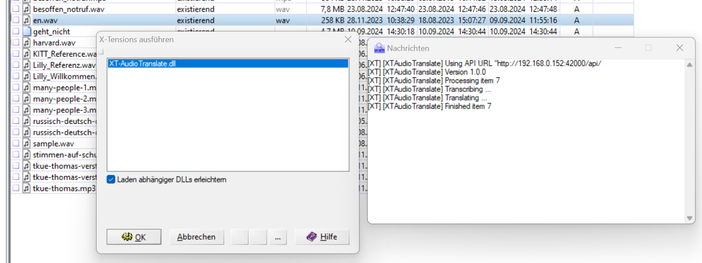

# xways-audiotranslate

[](https://deepwiki.com/hilderonny/xways-audiotranslate)

[X-Ways](https://www.x-ways.net/) extension for audio translation via distributed workers. Uses [Task Bridge](https://github.com/hilderonny/taskbridge) together with [Transcribe](https://github.com/hilderonny/taskworker-transcribe) and [Translate](https://github.com/hilderonny/taskworker-translate) workers for distributing and doing the work.


## Output

Using this extension each media file (audio, video) will get the following additional metadata.

|Property|Description|
|-|-|
|`[XTAT] audio:translation:language`|First language detected in the media file. If the file contains mutliple languages, only the first one is detected.|
|`[XTAT] audio:translation:original`|Transcribed text of the media file in its original language|
|`[XTAT] audio:translation:de`|Text in german|

Example:

```
[XTAT] audio:translate:language ar
[XTAT] audio:translate:original سبحان الله والحمد لله ولا إله إلا الله والله أكبر ولا حول ولا قوة إلا بالله العلي العظيم
[XTAT] audio:translate:de Gottes Segen Danke an Gott Es gibt keinen Gott außer Gott. Gott ist größer. Keine Macht und keine Macht. Nur bei Gott, dem Höchsten.
```

## Installation

First download an install [X-Ways](https://www.x-ways.net/).

Next download the actual [release ZIP file](https://github.com/hilderonny/xways-audiotranslate/releases) and extract it. Copy the file `XTAudioTranslate.cfg` into the X-Ways program folder where the .exe file is (e.g. "C:\Tools\xw_forensics210").

Copy the `XT-AudioTranslate.dll` to a place of your choice. In X-Ways right click on a file and select **X-Tension ausführen ...**. In the dialog click the **+** button (Modul ausführen...) and select the `XT-AudioTranslate.dll` file. After that the file will be listed as runnable X-Tension.

## Configuration

The configuration is done in the file `XTAudioTranslate.cfg` in your X-Ways directory. This file contains the URL of you TaskBridge.

```
http://192.168.0.152:42000/api/
```

Make sure to define the IP address of the TaskBridge and not the domain name. And make also sure that the TaskBridge can be accessed via HTTP (HTTPS is currently not supported).

## Running

In X-Ways right click on a file and select **X-Tension ausführen ...**. Select the **XT-AudioTranslate.dll** entry in the X-Tensions list and click on **OK**.



While running the progress will be shown in the message window. When the process finished, the message `XT] [XTAudioTranslate] Finished item` is printed out and the result can be found in the metadata of the item.

It is also possible to select multiple items at once and run the X-Tension. In this case each item will be processed individually one after another and the process will take longer. But in the end each item gets the transcription and translation as metadata.
